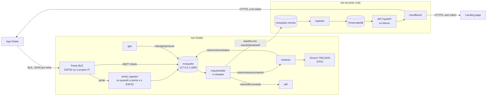
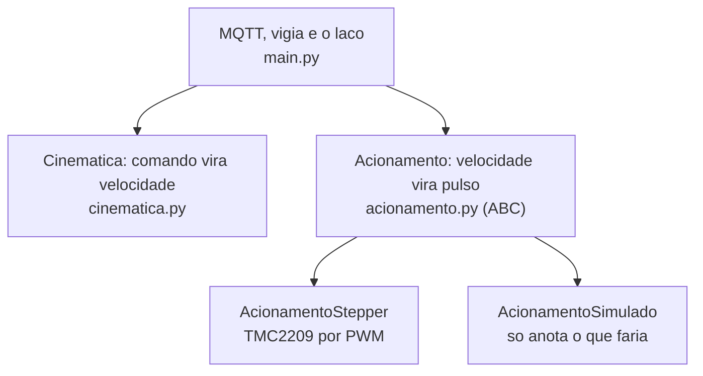
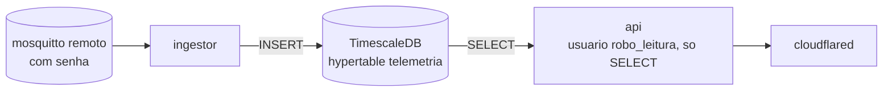
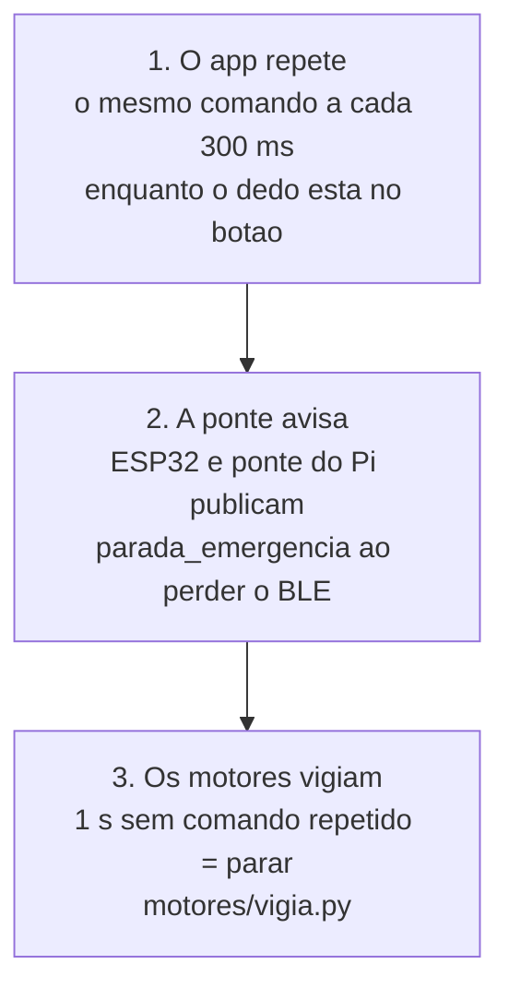

# Como funciona o `orquestrador`

> **Para quem nunca viu este projeto.** Este documento é um passeio guiado pelo
> código: o que cada peça faz, por onde a informação passa, e por que o desenho
> é esse. Leva uns quinze minutos e não exige ter o robô na frente.
>
> - Quer **instalar**? → [`docs/README.md`](./docs/README.md)
> - Quer o **contrato MQTT** completo? → [`docs/contrato-mqtt.md`](./docs/contrato-mqtt.md)
> - Quer ver como os **três repositórios** se encaixam?
>   → [`MAPA-COMUNICACAO.md`](./MAPA-COMUNICACAO.md)

---

## 1. Em uma frase

Este repositório é **o corpo da Atlas**: o que faz o robô se mover, saber onde
está, e guardar o histórico do que fez.

São três frentes que quase não se conhecem:

| Frente | Onde roda | O que é |
|---|---|---|
| **`esp32/`** | No microcontrolador | Firmware que faz a ponte entre o Bluetooth do celular e a serial do Pi |
| **`pi/services/`** | No Raspberry Pi | Cinco serviços Python independentes, ligados por MQTT |
| **`cloud/`** | Numa VM (LARCC) | Broker remoto, banco de séries temporais, API de leitura e o túnel |
| **`site/`** | Cloudflare Pages | A landing page, HTML/CSS/JS puros |

A **cara** do robô — a face animada, a voz, a IA — é do outro repositório,
[`atlas_ai_v2`](../RobotEye).

---

## 2. O mapa



**A leitura mais curta do diagrama:** há dois caminhos, e eles são de mão única.

- **O de ida (comando):** app → rádio → MQTT → roteador → serviço → motor.
- **O de volta (telemetria):** serviço → MQTT → espelho → nuvem → banco → API →
  app.

Nenhum serviço fala com outro diretamente. Todos falam com o **barramento
MQTT**, e é isso que permite ligar um serviço novo sem tocar em nenhum dos que
já existem.

---

## 3. O caminho de um comando, passo a passo

Alguém encosta o dedo no botão **FRENTE** do app:

| # | Onde | O que acontece |
|---|---|---|
| 1 | App | Escreve `{"cmd":"F"}\n` na característica BLE. E **repete a cada 300 ms** enquanto o dedo estiver no botão (ver [§6](#6-segurança-de-movimento-três-camadas-independentes)). |
| 2 | Ponte | O ESP32 (`esp32_ble_bridge.ino`) ou o próprio Pi valida que é JSON e repassa. **Não interpreta**: não sabe o que é `"F"`. |
| 3 | `serial_ingestor` | Só existe quando a ponte é o ESP32. Lê linhas da serial e publica cada uma em `robo/comando/entrada`, sem interpretar. |
| 4 | `orquestrador/roteador.py` | Traduz. `{"cmd":"F"}` vira `{"acao":"frente","velocidade":60}` em `robo/motores/comando`. É aqui que a entrada não-confiável é validada e saturada. |
| 5 | `motores/main.py` | Recebe pela thread do MQTT, sob cadeado. |
| 6 | `motores/cinematica.py` | `"frente"` vira `Velocidades(esquerda=1.0, direita=1.0)`. A `Rampa` acelera até lá sem tranco. |
| 7 | `motores/acionamento.py` | A velocidade vira frequência de uma onda quadrada no pino STEP. O motor gira sozinho enquanto ninguém mexer. |
| 8 | `motores/vigia.py` | Em paralelo: se passar **1 segundo** sem o comando ser repetido, para tudo. Silêncio significa “pare”. |

E o caminho de volta, da posição do GPS até o gráfico no celular:

| # | Onde | O que acontece |
|---|---|---|
| 1 | `gps/main.py` | Lê sentenças NMEA da serial, extrai posição e publica em `robo/gps/posicao` (retained). |
| 2 | `orquestrador/main.py` | Espelha `robo/gps/posicao` → `robo/telemetria/gps`. **Só o roteador decide o que vira histórico** — nenhum serviço precisa saber disso. |
| 3 | Bridge do Mosquitto | Replica `robo/telemetria/#` para o broker da nuvem. |
| 4 | `cloud/ingestor/main.py` | Assina e grava numa hypertable do TimescaleDB. |
| 5 | `cloud/api/consultas.py` | Monta o SQL. **Não toca no banco** — devolve `(sql, parâmetros)`. |
| 6 | `cloud/api/main.py` | Serve por HTTP, atrás do túnel da Cloudflare. |
| 7 | App | Desenha o mapa e os gráficos. |

---

## 4. As peças, uma a uma

### `pi/services/` — os cinco serviços

Cada um tem o seu `pyproject.toml`, roda como um serviço systemd separado, e
compartilha só a biblioteca `robo_common`.

| Serviço | Assina | Publica | O que faz |
|---|---|---|---|
| **`serial_ingestor`** | — | `robo/comando/entrada` | Lê linhas da serial do ESP32 e repassa. Nada mais. |
| **`orquestrador`** | `robo/comando/entrada` + os tópicos vivos | `robo/{motores,voz,wifi,rota}/comando` + `robo/telemetria/*` | Roteia comandos e espelha telemetria. |
| **`motores`** | `robo/motores/comando` | `robo/motores/status` | Executa o movimento. |
| **`gps`** | — | `robo/gps/posicao` | Lê NMEA e publica posição. |
| **`wifi`** | `robo/wifi/comando` | `robo/sistema/wifi` | Provisiona rede com o `nmcli`. Roda como root. |

### `robo_common/` — a biblioteca compartilhada

Dois arquivos, e os dois valem a leitura:

- **`topics.py`** — todo nome de tópico MQTT do projeto, num lugar só. É o
  reflexo em código do `docs/contrato-mqtt.md`. **Nunca escreva o nome de um
  tópico à mão em outro arquivo.**
- **`mqtt_client.py`** — o `MqttService`, que embrulha o paho com o que todo
  serviço precisa: reconexão automática, re-inscrição depois de cair, JSON
  inválido descartado sem derrubar o serviço, e **Last Will** — se o processo
  morrer sem avisar, o broker publica “offline” por ele.

### `motores/` — três camadas, e as duas de baixo rodam sem robô

Esta é a parte mais bem separada do repositório, e vale como modelo:



- **`cinematica.py`** é **puro**: sem GPIO, sem MQTT e **sem relógio próprio**.
  Quem chama informa o `dt`, então uma rampa de meio segundo é testada em zero
  segundos.
- **`acionamento.py`** é uma ABC. `MOTORES_BACKEND=simulado` sobe o serviço num
  notebook e mostra no log o que o robô faria.
- **`main.py`** não sabe o que é um GPIO.

**O pulso deixou de ser feito em Python.** A versão anterior escrevia cada
flanco do STEP à mão com `time.sleep(delay)` — e um sleep de meio milissegundo
não dorme meio milissegundo, dorme o que o escalonador resolver; a variação ia
para o motor como tremor. Hoje o pino recebe uma onda quadrada do PWM, e mudar a
velocidade é escrever um número.

### `roteador.py` — Command Pattern, não um dicionário de funções

`ComandoRoteavel` é uma ABC; cada tipo de comando do app é uma subclasse
registrada em `_ROTAS`. `rotear()` despacha polimorficamente sem saber qual
subclasse está do outro lado. Adicionar um comando novo é criar a subclasse e
registrá-la — `rotear()` nunca muda.

Ele também é a **fronteira de confiança**: tudo que vem do app é validado e
saturado aqui. Velocidade fora de 0–100 é cortada; eixo fora de -1 a 1 é
cortado; coordenada fora do planeta é descartada; comando malformado vira lista
vazia e um aviso no log — **nunca uma exceção**.

### `cloud/` — o caminho de volta



**A API nunca escreve.** Ela roda com um usuário de banco separado, só com
`SELECT` — é a única peça exposta à internet, e um bug numa rota não pode ser
capaz de apagar meses de telemetria.

E tem **duas portas**:

| Porta | Exige | Serve |
|---|---|---|
| `/v1/...` | `Authorization: Bearer` | Tudo, inclusive as coordenadas exatas |
| `/v1/publico/...` | Nada | O resumo, e o trajeto com a posição arredondada para ~11 m |

A landing page é estática: qualquer token no JavaScript dela seria legível por
quem abrisse o inspetor. Então, em vez de fingir que é segredo, **aquela porta
serve menos**.

### `esp32/` — o firmware

Uma ponte BLE ↔ Serial e nada mais. Valida que a linha é JSON e repassa; se não
for, responde erro pela característica de notificação. **Não interpreta
comandos** — não sabe o que é `"F"`.

BLE e não Bluetooth Classic porque o app roda em iOS também, e o iOS nunca
ofereceu SPP para apps de terceiros.

---

## 5. O barramento MQTT, em uma tabela

Esta é a espinha do repositório. A fonte de verdade é
[`robo_common/topics.py`](./pi/services/_common/src/robo_common/topics.py).

| Tópico | Quem publica | Quem consome | Conteúdo |
|---|---|---|---|
| `robo/comando/entrada` | ponte BLE ou `serial_ingestor` | `orquestrador` | o JSON cru vindo do app |
| `robo/motores/comando` | `orquestrador` | `motores` | `{"acao":"mover","linear":…,"angular":…}` |
| `robo/motores/status` | `motores` | telemetria | estado dos motores (retained) |
| `robo/gps/posicao` | `gps` | telemetria | posição atual (retained) |
| `robo/wifi/comando` | `orquestrador` | `wifi` | provisionamento de rede |
| `robo/sistema/wifi` | `wifi` | telemetria | estado da conexão |
| `robo/voz/falar` | `orquestrador` | *(ninguém ainda)* | texto para a Atlas falar |
| `robo/rota/comando` | `orquestrador` | *(ninguém ainda)* | a rota segura, fatiada |
| `robo/sistema/heartbeat/<serviço>` | cada serviço | telemetria | “online” / “offline” (Last Will) |
| `robo/telemetria/#` | `orquestrador` (espelho) | bridge → nuvem | tudo que vira histórico |

---

## 6. Segurança de movimento: três camadas independentes

Um comando de movimento **não vale para sempre**. Esta é a regra mais
importante do repositório, e ela está implementada três vezes, de propósito:



Por que três? Porque cada uma cobre a falha da anterior:

- O app repetir não ajuda se **o app** morrer → a ponte percebe a queda do BLE.
- A ponte avisar não ajuda se **a ponte** travar → os motores percebem o
  silêncio.
- Os motores vigiarem é a última linha, e não depende de mais ninguém estar vivo.

**Ao mexer em qualquer ponto desse caminho, pergunte: o que acontece se isto
morrer no meio de um movimento?** E prefira sempre a resposta que para o robô.

---

## 7. As decisões que explicam o desenho

**1. Ninguém fala com ninguém — todos falam com o barramento.** Um serviço novo
entra assinando um tópico, sem tocar em nenhum dos que já existem. É o que
permite trocar o ESP32 pelo rádio do próprio Pi sem que `motores` saiba.

**2. Quem decide o que vira histórico é um só.** Os serviços publicam o estado
“vivo”; o `orquestrador` espelha para `robo/telemetria/*` o que deve persistir.
Acrescentar uma fonte de histórico é acrescentar uma linha em
`ESPELHO_TELEMETRIA`.

**3. Quem calcula não toca em infraestrutura.** `roteador.py`,
`motores/cinematica.py` e `cloud/api/consultas.py` seguem todos o mesmo desenho:
recebem dados, devolvem dados, e não abrem conexão nenhuma. É o que faz 135
testes rodarem em menos de um segundo, sem broker, sem banco e sem robô.

**4. O app é entrada não-confiável.** Ele atravessa um rádio que não pede senha.
Tudo que vem dele é validado e saturado antes de virar movimento ou consulta —
`limitar()`, `_limitar_eixo()`, `campo_valido()`, `INTERVALOS`.

---

## 8. Rodando os testes

Nenhum precisa de Raspberry Pi, motor, broker ou banco.

```bash
# Tudo de uma vez, num container descartável (não instala nada na sua máquina)
./scripts/testar.sh

# Ou serviço a serviço:
cd pi/services/motores      && PYTHONPATH="src:../_common/src" python -m unittest discover -s tests   # 52
cd pi/services/orquestrador && PYTHONPATH="src:../_common/src" python -m unittest discover -s tests   # 30
cd pi/services/wifi         && PYTHONPATH="src:../_common/src" python -m unittest discover -s tests   # 16

cd cloud/api
python3 -m pip install -r requirements-dev.txt   # httpx: o TestClient roda nele
python3 -m unittest discover -s tests                                                                 # 37
```

**Sem dados para testar a nuvem?** `cloud/scripts/semear-demonstracao.py` enche
o banco com um trajeto plausível em volta do campus, bateria descarregando e
comandos de motor coerentes com a curva. Tudo marcado com `"demo": true`, que é
o que faz `--limpar` nunca tocar em telemetria de verdade.

---

## 9. Duas armadilhas que já custaram caro

**⚠️ Um broker só na porta 1883.** O setup do `atlas_ai_v2` instala o Mosquitto
pelo `apt`; o `pi/docker-compose.yml` daqui sobe outro na mesma porta. O segundo
a subir falha com *“Address already in use”*, e o sintoma **não parece de
broker**: o app conecta, os comandos chegam ao Pi e o robô não se mexe.

```bash
systemctl is-active mosquitto        # o do apt
docker ps --filter name=mosquitto    # o do compose
sudo ss -lntp | grep 1883            # quem realmente está com a porta
```

**⚠️ Os serviços deste repositório não estão instalados no robô.** Conferido por
SSH: no Pi rodam a face, a ponte BLE e o Mosquitto — e mais nada. O comando
chega em `robo/comando/entrada` e para ali. Ver a §0 do
[`MAPA-COMUNICACAO.md`](./MAPA-COMUNICACAO.md), que traz o teste de dez segundos
para confirmar.

---

## 10. Onde continuar lendo

| Documento | Para quê |
|---|---|
| [`MAPA-COMUNICACAO.md`](./MAPA-COMUNICACAO.md) | As fronteiras entre os três repositórios, e o que está no ar hoje |
| [`docs/contrato-mqtt.md`](./docs/contrato-mqtt.md) | O formato exato de cada mensagem |
| [`docs/setup-pi.md`](./docs/setup-pi.md) | Instalar os serviços no Raspberry Pi |
| [`docs/setup-cloud.md`](./docs/setup-cloud.md) | Subir o broker, o banco, a API e o túnel |
| [`docs/setup-esp32.md`](./docs/setup-esp32.md) | Gravar o firmware |
| [`CLAUDE.md`](./CLAUDE.md) | Convenções do repositório |
