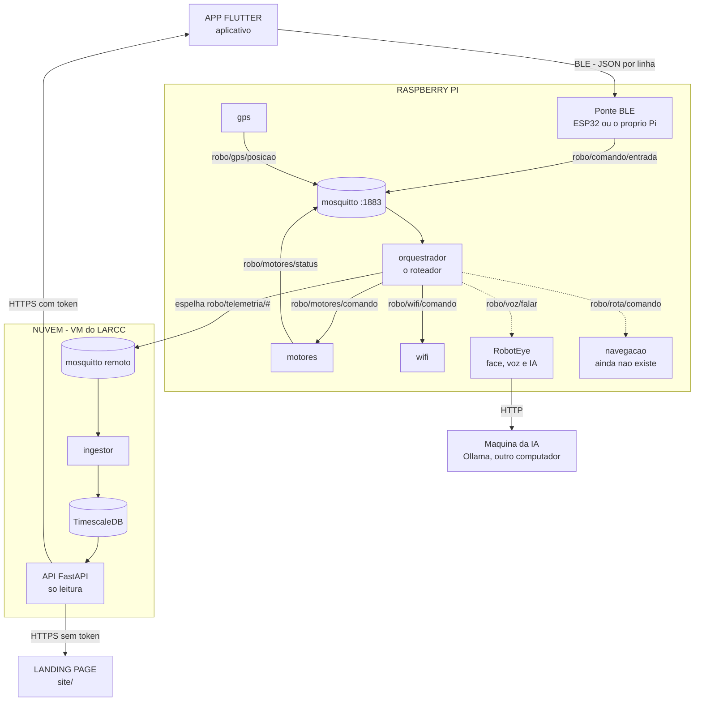

# Mapa de comunicação da Atlas

A **Atlas** — o robô do curso de Engenharia de Computação da Setrem — é feita de
**três repositórios que rodam sozinhos**, mas que precisam falar a mesma língua
nas fronteiras. Este documento é o mapa dessas fronteiras: quem fala com quem,
por qual transporte, em qual formato, e onde mora o contrato de cada conversa.

> **Onde este arquivo mora.** Dentro do repositório `orquestrador`, que é quem
> guarda o contrato MQTT (`robo_common/topics.py`) — a fronteira mais movimentada
> das três. Antes ele existia só na máquina de quem o escreveu, fora de qualquer
> repositório: o mapa do sistema inteiro dependia de um disco não fazer barulho.
>
> **Última conferência contra o robô real:** 3 de setembro de 2026, por SSH em
> `atlas@atlas.local`. A §0 diz o que estava no ar naquele dia.

> **Para quem é isto?** Para quem (pessoa ou Claude) vai mexer em qualquer ponto
> onde dois repositórios se encontram. Dentro de um repositório, o `CLAUDE.md`
> e o `README.md` dele bastam. **Aqui é só o que atravessa as bordas** — e é
> justamente aí que uma mudança num lado quebra o outro em silêncio.

Os três repositórios (são pastas irmãs de onde este arquivo mora):

| Repositório | Apelido | O que é |
|---|---|---|
| [`atlas_ai_v2`](../RobotEye) (RobotEye) | a **cara** | face animada em pygame, IA (Ollama), voz (TTS/STT) e a ponte BLE que roda no Pi |
| [`orquestrador`](.) | o **corpo** | firmware do ESP32, serviços Python do Raspberry Pi (motores, GPS, Wi-Fi) e a nuvem |
| [`aplicativo`](../app) | o **controle** | app Flutter (Android/iOS) para dirigir o robô e ver a telemetria |

---

## 0. O que está no ar hoje, e onde a corrente arrebenta

> **Leia esta seção antes do diagrama.** O diagrama abaixo mostra o sistema
> **projetado**. Esta seção mostra o que está **instalado** no Raspberry Pi de
> produção (`atlas@atlas.local`), conferido por SSH. A diferença entre os dois é
> a explicação de por que o robô não anda.

No Pi, hoje, rodam **três coisas** — e nenhuma delas é do repositório
`orquestrador`:

```console
$ systemctl list-units --type=service --state=running | grep -iE 'roboteye|mosquitto'
mosquitto.service      Mosquitto MQTT Broker
roboteye.service       RobotEye - face robotica com IA e voz
roboteye-ble.service   RobotEye - ponte bluetooth para o controle do celular
```

Ou seja: **a cara está instalada, o corpo não.** Não existe `/opt`, `/srv` nem
`~/robo` com os serviços do `pi/services/`; nenhum `motores`, `orquestrador`,
`gps`, `wifi` ou `serial_ingestor` está registrado no systemd.

O efeito prático, seguindo o caminho de um comando de direção:

```
App aperta "frente"
   │  BLE, {"cmd":"F"}

   ▼
roboteye-ble  ──publica──►  robo/comando/entrada        ✅ chega aqui
   ▼
(orquestrador — o roteador)                             ❌ NÃO INSTALADO
   ▼
robo/motores/comando                                    ❌ ninguém publica
   ▼
(serviço motores)                                       ❌ NÃO INSTALADO
```

**O comando chega ao Pi e morre no barramento.** O app diz "conectado", a página
do celular mostra o comando chegando em `robo/comando/entrada`, o log da ponte
não acusa erro nenhum — e o robô não se mexe. É exatamente o sintoma que a §5
descreve para o caso dos dois brokers, com outra causa: aqui não há **dois**
brokers, há **um consumidor de menos**.

Confirmar isto leva dez segundos, e é o primeiro teste a fazer quando o robô não
anda:

```bash
# No Pi. Aperte uma direção no app enquanto isto roda.
mosquitto_sub -h 127.0.0.1 -t 'robo/#' -v
```

- Nada aparece → o problema é o app ou a ponte BLE.
- Aparece `robo/comando/entrada {"cmd":"F"}` e **mais nada** → é este caso: o
  roteador não está instalado. Veja `docs/setup-pi.md`.
- Aparece também `robo/motores/comando` → o software está certo, o problema é
  do motor para baixo (fiação, driver, alimentação).

**Como instalar o corpo:** `pi/scripts/install.sh`, com a ressalva da §5 sobre o
broker — o Mosquitto do `apt` já está de pé e é o que a ponte BLE usa, então o
`pi/docker-compose.yml` **não** deve subir outro.

### O resto do ambiente, em números

Conferido por SSH no mesmo dia:

| O quê | Estado |
|---|---|
| Hardware | Raspberry Pi 5, 8 GB, Debian 13 (trixie), kernel 6.18 |
| Disco | 29 GB, 31% usado |
| Broker MQTT | Mosquitto do `apt`, escutando **só** em `127.0.0.1:1883` |
| IA principal | `http://KerlonPC.local:11434` (`qwen3:8b`) — fora do ar quando o PC está desligado |
| IA de reserva | Ollama **no próprio Pi**, `gemma3:1b` |
| Página de configuração | `0.0.0.0:8080`, protegida por PIN |
| Temperatura | 70–73 °C em repouso, 86 °C em pico; **sem ventoinha**, e já com corte de frequência registrado |
| Nuvem (`cloud/`) | **não** roda no Pi — é outra máquina (VM do LARCC) |

---

## 1. O sistema numa tela



> **Duas ressalvas importantes sobre este diagrama.**
>
> 1. Ele mostra o sistema **projetado**. Hoje, no robô real, os serviços do
>    `orquestrador` (o roteador, `motores`, `gps`, `wifi`) **não estão
>    instalados** — ver a §0. As setas que saem do broker para eles são planta,
>    não construção.
> 2. As setas para `robo/voz/falar` e `robo/rota/comando` mostram para onde o
>    roteador publica. **Ninguém consome esses dois tópicos ainda** — são
>    ganchos para trabalho futuro (§6).

Para entender cada repositório por dentro, há um passeio guiado em cada um:

| Repositório | Passeio guiado |
|---|---|
| `atlas_ai_v2` — a cara | [`../RobotEye/COMO-FUNCIONA.md`](../RobotEye/COMO-FUNCIONA.md) |
| `orquestrador` — o corpo | [`COMO-FUNCIONA.md`](./COMO-FUNCIONA.md) |
| `aplicativo` — o controle | [`../app/COMO-FUNCIONA.md`](../app/COMO-FUNCIONA.md) |

---

## 2. As conversas, uma a uma

### 2.1 App ↔ Robô — **Bluetooth Low Energy (BLE)**
- **Transporte:** BLE, perfil **Nordic UART Service (NUS)**. O app escreve na
  característica RX; o robô notifica pela TX.
- **Direção:** o app **escreve** comandos; o robô raramente responde (comando de
  direção é `withoutResponse` — o próximo já vem a caminho).
- **Formato:** uma linha JSON por mensagem, terminada em `\n`. Ex.: `{"cmd":"F"}`
  (frente) e, agora, a rota segura fatiada (ver §3).
- **Quem é a ponte:** ou o **ESP32** (`orquestrador/esp32/esp32_ble_bridge`), ou
  o **próprio Pi** (`../RobotEye/src/roboteye/ble/`). Qualquer um dos dois valida o
  JSON e publica em `robo/comando/entrada`. **Só um deve estar ativo por vez.**
- **⚠️ Contrato que precisa bater nos dois lados:** os UUIDs do serviço BLE.
  - App: `RobotBleIds` em `../app/lib/services/robot_connection.dart`
    (`serviceUuid = 6e400001-b5a3-f393-e0a9-e50e24dcca9e`, RX `…0002`, TX `…0003`).
  - ESP32: no topo de `esp32/esp32_ble_bridge/*.ino`.
  - Pi: `../RobotEye/src/roboteye/ble/nus.py`.
  - **Mudou um, muda os três** — senão o celular não acha o robô, ou acha e
    nada chega.

### 2.2 Dentro do Pi — **MQTT (Mosquitto, porta 1883)**
- **Transporte:** MQTT num broker local. É o barramento que liga a ponte BLE aos
  serviços (motores, gps, wifi) e ao RobotEye.
- **Contrato (fonte de verdade):** `pi/services/_common/src/robo_common/topics.py`
  e `docs/contrato-mqtt.md`. **Nunca** escreva o nome de um tópico
  à mão em outro lugar — importe de `topics.py`.

| Tópico | Quem publica | Quem consome | Conteúdo |
|---|---|---|---|
| `robo/comando/entrada` | ponte BLE (ESP32 ou Pi) | orquestrador | o JSON cru vindo do app |
| `robo/motores/comando` | orquestrador | serviço `motores` | `{"acao":"mover","linear":…,"angular":…}` |
| `robo/motores/status` | `motores` | telemetria | estado dos motores |
| `robo/voz/falar` | orquestrador | *(RobotEye, futuro)* | texto para a Atlas falar |
| `robo/wifi/comando` | orquestrador | serviço `wifi` | provisionamento de rede |
| `robo/gps/posicao` | serviço `gps` | telemetria | posição atual |
| `robo/rota/comando` 🆕 | orquestrador | *(ninguém ainda)* | a rota segura, fatiada (ver §3) |
| `robo/sistema/bateria` · `…/heartbeat` · `…/bridge_status` | serviços | telemetria | saúde do robô |
| `robo/telemetria/#` | ingestor da nuvem assina | → TimescaleDB | tudo que vira histórico |

### 2.3 Robô → Nuvem — **MQTT → ingestor → TimescaleDB**
- O que o robô produz (`robo/gps/posicao`, `robo/sistema/*`, `robo/motores/status`)
  é espelhado para o Mosquitto **da nuvem**; o `ingestor` (`cloud/ingestor`)
  assina e grava no **TimescaleDB**. É o **caminho de ida** (robô → banco).
- **⚠️ `robo/rota/*` não é espelhado para a nuvem** enquanto não houver quem o
  consuma — é comando planejado, não telemetria.

### 2.4 App ↔ Nuvem — **HTTP (FastAPI, só leitura)**
- **Transporte:** HTTP, exposto por **Cloudflare Tunnel** num domínio.
- **Direção:** o app **lê** a telemetria; **nunca escreve** (a API roda com um
  usuário de banco só-`SELECT`). É o **caminho de volta** (banco → celular).
- **Duas portas:** `/v1/...` (exige `Authorization: Bearer`, serve tudo) e
  `/v1/publico/...` (sem token, serve menos — resumo e trajeto arredondado).
- **Cliente no app:** `../app/lib/services/telemetry_api.dart` (o único arquivo do
  app que sabe o que é uma requisição HTTP). Endereço e token em
  `SharedPreferences` (tela de ajustes) ou por `--dart-define`.
- **Contrato:** `cloud/api/` e `docs/setup-cloud.md`.

### 2.5 Landing site → Nuvem — **HTTP (rotas públicas)**
- O `site/` (HTML/CSS/JS puro, no Cloudflare Pages) consome só as
  rotas `/v1/publico/...` — sem token, porque um segredo no JavaScript de uma
  página estática não é segredo.

### 2.6 RobotEye ↔ IA — **HTTP (Ollama, outra máquina)**
- A cara conversa com o **Ollama** por HTTP, geralmente por VPN, numa máquina
  separada (ver `../RobotEye/.env` → `ROBOTEYE_OLLAMA_HOST`). Voz (TTS/STT) e face
  são internas ao RobotEye e **não** aparecem neste mapa.

---

## 3. A rota segura, ponta a ponta (novidade)

A rota é **planejada no app** e serve de guia; **o robô ainda não a segue
sozinho** (segue teleoperado). O caminho existente é o de *entregar e validar* a
rota, como gancho para um futuro serviço de navegação.

```
App desenha waypoints dentro de uma cerca (geofence)
   │  RotaSegura.paraMensagensBle()  →  fatia em linhas ≤512 B (limite do ESP32)
   ▼
{"tipo":"rota","acao":"inicio","total":N,"nome":"…"}   ┐
{"tipo":"rota","acao":"ponto","i":0,"lat":…,"lon":…}   │ BLE, uma linha por vez
… (um "ponto" por waypoint) …                          │
{"tipo":"rota","acao":"fim"}                           ┘
   │  ponte BLE → robo/comando/entrada
   ▼
orquestrador: ComandoRota valida cada mensagem (coordenada no planeta? índice ok?)
   │  e republica, SEM ESTADO, em:
   ▼
robo/rota/comando   →   (nenhum consumidor hoje — gancho para navegação futura)
```

- **App:** `../app/lib/models/rota_segura.dart` (modelo + cerca + fatiamento),
  `rota_segura_screen.dart` (desenhar no mapa OSM), `rota_store.dart` (persistir).
  Só o `RobotConnection.enviarRota` fala com o rádio.
- **Orquestrador:** `ComandoRota` em `pi/services/orquestrador/src/orquestrador/roteador.py`,
  tópico `ROTA_COMANDO` em `topics.py`, contrato em `docs/contrato-mqtt.md`.
- **Por que fatiada:** uma linha BLE não passa de **512 bytes** no firmware do
  ESP32. Cada linha da rota fica em ~65 bytes, com folga.
- **Segurança:** a cerca (um círculo em volta da partida) impede desenhar rota
  que sai da área combinada; e o orquestrador descarta coordenada/índice inválidos,
  porque a origem (o app) é entrada não-confiável.

---

## 4. Contratos que precisam ficar em sincronia

Estes são os pontos onde **mudar um lado sem o outro quebra em silêncio**:

1. **UUIDs BLE** — app (`RobotBleIds`), ESP32 (`.ino`) e Pi (`ble/nus.py`). §2.1.
2. **Nomes de tópicos MQTT** — sempre de `robo_common/topics.py`. §2.2.
3. **Formato das mensagens de comando** — `{"cmd":"X"}` e `{"tipo":"…",…}`,
   documentado em `docs/contrato-mqtt.md`.
4. **Contrato da API** — rotas e formato em `cloud/api/` consumidas
   por `../app/lib/services/telemetry_api.dart` e pelo `site/`.

---

## 5. Armadilhas conhecidas

- **⚠️ Um broker só (porta 1883).** O setup do RobotEye
  (`scripts/setup-raspberry-pi.sh --bluetooth-app`) instala o Mosquitto pelo apt,
  e o `pi/docker-compose.yml` sobe outro na mesma porta. O segundo a
  subir falha com *"Address already in use"*, e o sintoma **não** parece de
  broker: o app conecta, os comandos chegam ao Pi e o robô **não se mexe** —
  porque uma das pontas publica num broker que ninguém escuta. Escolha **uma**
  fonte de Mosquitto.
- **⚠️ Duas pontes BLE.** ESP32 **ou** o Pi anunciam o serviço — nunca os dois ao
  mesmo tempo, senão o celular pareia com um e os comandos vão para o outro.
- **`kotlin.incremental=false`** no `app/android/gradle.properties` é necessário
  para buildar de um drive montado (`D:\` no WSL) — não remova.
- **Trocar o ícone do app exige release novo** (recurso nativo; nenhum patch
  Shorebird o entrega).
- **⚠️ O limite de uma linha BLE é 512 bytes nas duas pontes.** `MAX_LINE` no
  `.ino` e `MAX_LINHA` em `../RobotEye/src/roboteye/ble/nus.py` já bateram 512 e
  256: nenhuma mensagem de hoje chega perto (um ponto de rota tem ~65 bytes),
  então a divergência não aparecia — apareceria na primeira mensagem entre 257 e
  512 bytes, e apareceria **só numa das duas pontes**, que é o tipo de defeito
  que se procura no lugar errado por um dia inteiro.
- **⚠️ O número de uma placa de som muda entre reinicializações.** Vale para
  qualquer coisa que escreva `card N` num arquivo: no robô, o `ctl` do
  `/etc/asound.conf` apontava para `card 2` (uma saída HDMI) enquanto o dongle
  USB era `card 0`, e todo `amixer` do sistema mexia no volume da tela. Escreva
  sempre o **nome** da placa.

---

## 5.1 Segurança: o que está aberto, e por quê

Nada aqui é novidade escondida — são escolhas conscientes de um projeto escolar.
Estão listadas porque *escolha consciente* e *esquecimento* se parecem muito
depois de seis meses, e quem chegar depois precisa saber qual é qual.

| O quê | Situação | O que a torna aceitável, e o que a tornaria inaceitável |
|---|---|---|
| **BLE sem pareamento** | Qualquer aparelho em alcance (~10 m) pode conectar e **dirigir o robô** | Aceitável com o robô sempre sob supervisão, numa sala. Deixa de ser no momento em que ele andar sozinho ou ficar ligado sem gente por perto. |
| **Wi-Fi provisionado por BLE** | SSID e senha atravessam o rádio **sem criptografia** e depois o MQTT em texto claro | Quem estiver por perto na hora do provisionamento lê a senha da rede. Prefira provisionar por SSH. |
| **MQTT sem autenticação** | Sem usuário nem senha no broker | Aceitável **porque ele escuta só em `127.0.0.1`** — confira com `ss -lntp \| grep 1883` antes de assumir. Abrir para a rede sem senha entrega os motores a quem estiver nela. |
| **Página `:8080` em `0.0.0.0`** | Alcançável por toda a rede local | Protegida por PIN de seis dígitos, com bloqueio após cinco erros. O PIN impede curiosidade, não um atacante decidido. Para valer mais, VLAN própria. |
| **SSH com senha fraca** | `PasswordAuthentication yes`, e a senha do usuário `atlas` é trivial | **É o ponto mais frágil de todos.** Vale para qualquer um na mesma rede, e dá acesso de sistema. Ver a receita abaixo. |
| **Token do GitHub em texto claro** | `~/.git-credentials` (modo 600), gravado pelo `credential.helper = store` | Sobrevive a um backup do cartão e a qualquer leitura do disco. Prefira um token de escopo mínimo, ou uma chave de deploy só de leitura. |
| **Token da API no app** | `SharedPreferences`, legível num aparelho com root | Aceitável: só dá leitura da telemetria. Deixa de ser se um dia der acesso de escrita. |

**Fechar o SSH**, que é o que mais vale a pena e leva dois minutos — só faça com
a chave já testada, senão você se tranca do lado de fora:

```bash
# 1. Do seu computador, instale sua chave (pede a senha uma última vez):
ssh-copy-id atlas@atlas.local

# 2. Confirme que a chave funciona ANTES de desligar a senha:
ssh -o PasswordAuthentication=no atlas@atlas.local 'echo entrei sem senha'

# 3. Só então, no Pi:
sudo passwd atlas                      # uma senha de verdade, para o sudo
echo 'PasswordAuthentication no' | sudo tee /etc/ssh/sshd_config.d/99-sem-senha.conf
sudo systemctl restart ssh
```

---

## 6. O que ainda **não** existe

- **Os serviços do `pi/services/` instalados no robô.** Hoje não estão — ver a
  §0. É o que falta para o robô andar quando alguém aperta uma direção no app, e
  é o item mais importante desta lista: sem ele, metade do diagrama da §1 é
  planta e não construção.
- Um serviço que **consuma `robo/rota/comando`** e faça o robô *seguir* a rota
  (malha fechada com GPS). Precisa de um Raspberry Pi real para desenvolver.
- O RobotEye **reagir** a `robo/sistema/bateria` ou **falar** quando alguém
  publica em `robo/voz/falar`. Os tópicos existem; o consumo é trabalho novo.
- GPS montado publicando de verdade — hoje a telemetria de posição depende disso.

---

> Mantenha este mapa junto com o código: quando uma fronteira mudar (um tópico
> novo, um campo a mais numa mensagem, uma rota de API), atualize a seção
> correspondente aqui **na mesma mudança**. Um mapa desatualizado é pior que
> nenhum, porque manda procurar no lugar errado.
